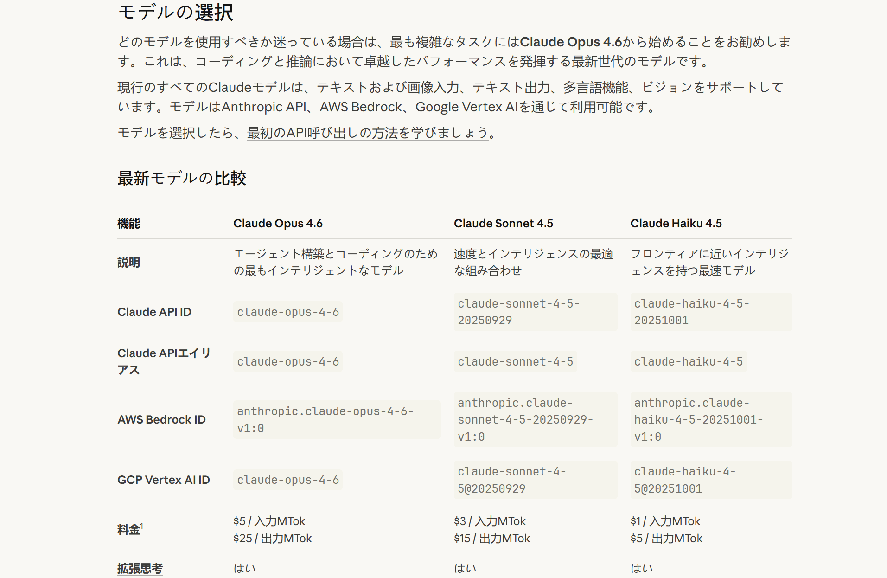

# Select AI 🎯

<div align="center">

**AI-powered Selection Search | Select to Explain | Context-aware**

[](LICENSE)
[]()

</div>
<div align="center">



</div>

## 🎯 Target Users / Scenarios

- Japanese learners: read news/Japanese content with kana ruby + TTS
- Technical readers: explain complex terms with context
- Global news readers: translate full pages quickly
- Cross-language collaboration: translate selected chats/emails

## 🚀 Quick Start

1. Install the extension and open settings
2. Enter your API Key, click **"Test Connection"**
3. Select text to see explanations/translations (kana ruby + TTS supported)

### Method 1: Direct Install (Recommended)

1. Download [select-ai.zip](select-ai.zip)
2. Extract to any directory
3. Open Chrome and visit `chrome://extensions/`
4. Enable **"Developer mode"** in the top right corner
5. Click **"Load unpacked"**
6. Select the extracted folder

### Method 2: Build from Source

```bash
cd select-ai
pnpm install
pnpm build
```

Build generates `dist/` and `select-ai.zip`. Load `dist/` in Chrome or unzip `select-ai.zip`.

### Configure API

1. Click the extension icon
2. Go to **"Settings"** to configure your API Key
3. Optionally customize API endpoint and model
4. Click **"Test Connection"** to verify configuration

## 💻 Usage

1. Select any text on a webpage
2. Click the pink-purple floating button
3. Wait for AI analysis and view the explanation

## ✨ Core Features

| Feature | Description | Use Case |
|---------|-------------|----------|
| 🎯 **Smart Selection** | Floating button appears on text selection, click to query | Get instant explanations |
| 🧠 **Context Awareness** | Auto-extract context (default 2000, adjustable 200-10000) | Technical terms, complex sentences |
| 🚀 **Streaming Output** | Stream responses in real time as they are generated | Get answers faster |
| 🌐 **Multi-language** | Supports Chinese, English, Japanese, Korean output | Foreign language reading & learning |
| 🇯🇵 **Kana Ruby** | Show kana above Japanese kanji (ruby) | Japanese reading & learning |
| 🔌 **Multi-API Support** | MiniMax / OpenAI / Anthropic / DeepSeek / Zhipu AI / Custom API | Flexible deployment, self-hosted services |
| 🔊 **Text-to-Speech** | Read original text and translation aloud | Listening & shadowing |
| 🔒 **Privacy First** | API keys stored locally, no user data collection | Secure usage |
| 📄 **Full Page Translation** | Auto-detect content, batch translate entire page | Foreign language websites |
| ✂️ **Selected Text** | Translate only selected text or paragraphs | Precise translation needs |
| ⚡ **Concurrent Translation** | Multi-paragraph parallel translation with loading states | Batch translation |
| 🧪 **Connection Test** | One-click API test in settings | Validate configuration fast |
| ⚙️ **Fine-grained Settings** | Translation button, CSS blacklist, concurrency, context length | Fit different scenarios |

## 🔐 Security & Privacy

- API Key stays in your local browser
- No user data collection

## 🔌 Supported APIs

This extension supports both OpenAI- and Anthropic-compatible APIs, with custom Base URLs:

| Provider | Default Model | Description |
|----------|---------------|-------------|
| **MiniMax** | MiniMax-M2.1 | Ready to use out of the box |
| **OpenAI** | gpt-4o | Compatible with GPT series |
| **Anthropic** | Claude Sonnet 4.5 | Compatible with Claude series |
| **DeepSeek** | deepseek-chat | Compatible with DeepSeek series |
| **Zhipu AI** | glm-4.7 | Zhipu AI series models |
| **Custom** | - | Any OpenAI/Anthropic-compatible API |

## 📝 FAQ

**Q: Why doesn't the extension respond?**
A: Make sure you have configured a valid API Key in settings.

**Q: Why doesn't the floating button appear?**
A: Check if the page has Content Script restrictions. Some sites (like `chrome://` pages) cannot inject content scripts.

**Q: What APIs are supported?**
A: Supports MiniMax, OpenAI, Anthropic, DeepSeek, Zhipu AI, and any custom API compatible with OpenAI/Anthropic formats.

## 🔧 Development

```bash
# Development mode (hot reload)
pnpm dev

# Build for production
pnpm build

# Linting
pnpm lint

# Local preview
pnpm preview
```

## 🛠️ Tech Stack

<div align="center">

✨ **React 19** + TypeScript
⚡ **Vite 7** + HMR
🔒 **Manifest V3**
📦 **@crxjs/vite-plugin**
🎨 **Tailwind CSS 4**
📱 **Chrome Extension**

</div>

## 🤝 Contributing

Contributions, issues, and feature requests are welcome!

- 🐛 Found a bug? Please [open an issue](https://github.com/EndlessGr1ef/select-ai/issues)
- 💡 Have an idea? Please [submit a Feature Request](https://github.com/EndlessGr1ef/select-ai/issues)
- 🔧 Want to contribute? Fork and submit a PR

## 📄 License

MIT License - see [LICENSE](LICENSE)

---

<div align="center">

**If you find this project helpful, please give it a Star ⭐**

</div>
