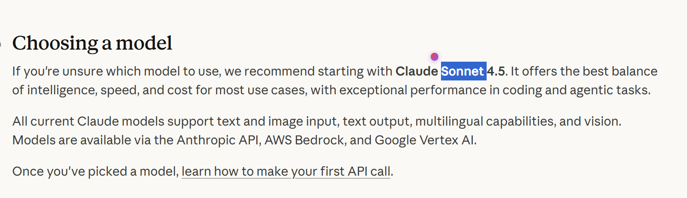
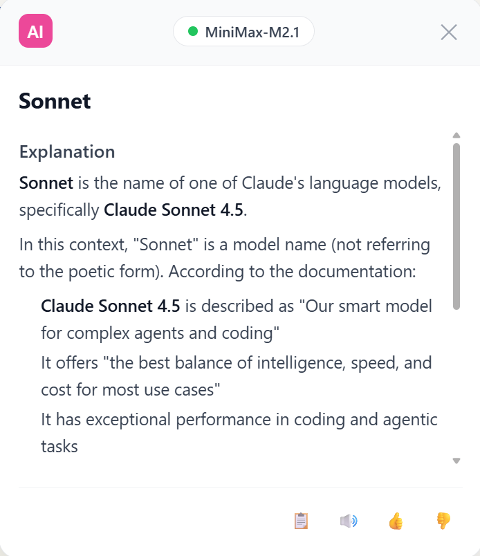

# Select AI 🎯

<div align="center">

**AI-powered Selection Search | Select to Explain | Context-aware**

[](LICENSE)
[]()

</div>




## ✨ Features

| Feature | Description | Use Case |
|---------|-------------|----------|
| 🎯 **Smart Selection** | Floating button appears on text selection, click to query | Get instant explanations |
| 🧠 **Context Awareness** | Auto-extract 500-3000 characters context for accurate AI understanding | Technical terms, complex sentences |
| 🌐 **Multi-language** | Supports Chinese, English, Japanese, Korean output | Foreign language reading & learning |
| 🔧 **Custom API** | Compatible with any Anthropic-format API | Flexible deployment, self-hosted services |
| 💬 **Markdown Rendering** | AI responses displayed in beautiful Markdown format | Clear, readable output |
| 🖱️ **Draggable Panel** | Results panel can be freely positioned | Comfortable user experience |
| 🔒 **Privacy First** | API keys stored locally, no user data collection | Secure usage |

## 📖 Why Select AI?

| Traditional Dictionaries | Select AI |
|--------------------------|-----------|
| Words/phrases only | Full translation & explanation |
| Limited vocabulary, slow updates | AI real-time understanding, broader coverage |
| No context support | Auto context extraction, handles technical terms |
| Single function | Multi-language, multi-model, customizable |

## 🚀 Quick Start

### 1. Install Dependencies

```bash
cd select-ai
pnpm install
```

### 2. Build the Extension

```bash
pnpm build
```

### 3. Load in Chrome

1. Open Chrome and visit `chrome://extensions/`
2. Enable **"Developer mode"** in the top right corner
3. Click **"Load unpacked"**
4. Select the `select-ai/dist` directory

### 4. Configure API

1. Click the extension icon
2. Go to **"Settings"** to configure your API Key
3. Optionally customize API endpoint and model

## 🔧 Development

```bash
# Development mode (hot reload)
pnpm dev

# Build for production
pnpm build

# Type checking
pnpm type-check
```

## 💻 Usage

1. Select any text on a webpage
2. Click the pink-purple floating button
3. Wait for AI analysis and view the explanation

## 🔌 Supported APIs

This extension is compatible with any Anthropic-format API:

| Provider | Default Model | Description |
|----------|---------------|-------------|
| **MiniMax** | MiniMax-M2.1 | Ready to use out of the box |
| **OpenAI** | GPT-4o | Compatible with GPT series |
| **Anthropic Claude** | Claude 3.5 | Compatible with Claude series |
| **Custom** | - | Any Anthropic-format API |

## 🛠️ Tech Stack

<div align="center">

✨ **React 19** + TypeScript
⚡ **Vite 7** + HMR
🔒 **Manifest V3**
📦 **@crxjs/vite-plugin**
🎨 **Tailwind CSS 4**
📱 **Chrome Extension**

</div>

## 📁 Project Structure

```
select-ai/
├── src/
│   ├── main.tsx              # Popup entry point
│   ├── App.tsx               # Popup UI
│   ├── background/
│   │   └── index.ts          # Service Worker (API request handling)
│   ├── content/
│   │   ├── index.tsx         # Content script entry
│   │   ├── ContentApp.tsx    # Selection floating UI
│   │   └── content.css       # Content script styles
│   ├── options/
│   │   ├── index.tsx         # Settings page entry
│   │   └── OptionsApp.tsx    # Settings page UI
│   └── utils/
│       ├── ContextExtractor.ts  # Context extraction algorithm
│       ├── i18n.ts              # Multi-language strings
│       └── language.ts          # Language detection
├── public/
│   └── icon.svg              # Extension icon
├── manifest.json             # Extension configuration
├── vite.config.ts            # Vite build configuration
└── package.json              # Dependencies
```

## 🤝 Contributing

Contributions, issues, and feature requests are welcome!

- 🐛 Found a bug? Please [open an issue](https://github.com/yourusername/select-ai/issues)
- 💡 Have an idea? Please [submit a Feature Request](https://github.com/yourusername/select-ai/issues)
- 🔧 Want to contribute? Fork and submit a PR

## 📝 FAQ

**Q: Why doesn't the extension respond?**
A: Make sure you have configured a valid API Key in settings.

**Q: Why doesn't the floating button appear?**
A: Check if the page has Content Script restrictions. Some sites (like `chrome://` pages) cannot inject content scripts.

**Q: What APIs are supported?**
A: Any API with Anthropic-compatible format is supported, including OpenAI, Claude, MiniMax, and more.

## 📄 License

MIT License - see [LICENSE](LICENSE)

---

<div align="center">

**If you find this project helpful, please give it a Star ⭐**

</div>
