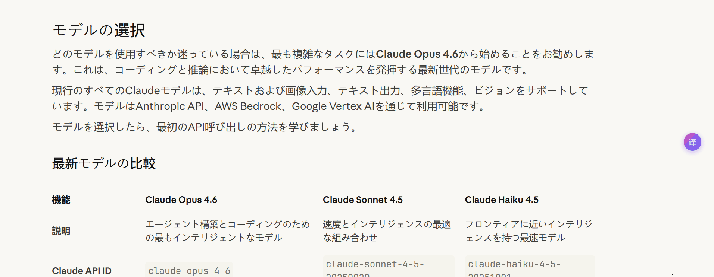

# Select AI - AI划词解释🎯

<div align="center">

**AI划词解释工具 | 选中即解释 | 智能上下文感知**

[](LICENSE)
[]()

</div>
<div align="center">




</div>

## 🎯 适用人群/场景

- 日语学习者：阅读新闻/日语内容时看假名标注 + 朗读练习
- 技术阅读者：阅读论文/文档时用上下文解释快速理解术语
- 国际资讯读者：外媒/报告整页翻译，快速抓重点
- 跨语协作场景：选中翻译对话/邮件，减少切换

## 🚀 快速开始

1. 安装扩展并打开设置页
2. 填写 API Key，点击 **"测试连接"**
3. 在网页划词即可查看解释/翻译（支持假名标注与朗读）

### 方式一：直接安装（推荐）

1. 下载 [select-ai.zip](select-ai.zip)
2. 解压到任意目录
3. 打开 Chrome，访问 `chrome://extensions/`
4. 开启右上角的 **"开发者模式"**
5. 点击 **"加载已解压的扩展程序"**
6. 选择解压后的文件夹

### 方式二：源码构建

```bash
cd select-ai
pnpm install
pnpm build
```

构建完成后会生成 `dist/` 与 `select-ai.zip`，可在 Chrome 中加载 `dist/` 或解压 `select-ai.zip`

### 配置 API

1. 点击扩展图标
2. 进入 **"设置"** 配置你的 API Key
3. 可自定义 API 端点和模型
4. 点击 **"测试连接"** 验证配置是否可用

## 💻 使用方法

1. 在任意网页中选中一段文字
2. 点击出现的粉紫色悬浮按钮
3. 等待 AI 分析并查看解释结果

## ✨ 核心功能

| 功能 | 描述 | 使用场景 |
|------|------|----------|
| 🎯 **智能划词** | 选中文字自动弹出悬浮按钮，点击即可查询 | 随时随地获取解释 |
| 🖼️ **图片OCR识别** | 右键图片提取文字并AI解释，支持截图识别 | 图片文字识别与翻译 |
| 📷 **截图识别** | 框选屏幕任意区域，OCR识别后AI解释 | 截图内容快速理解 |
| 🧠 **上下文感知** | 自动提取上下文（默认 5000，可调 200-50000），AI 理解更准确 | 专业术语、复杂句子 |
| 📊 **解释详细程度** | 可选简洁/标准/详细，控制解释内容详略 | 快速浏览或深入学习 |
| 🚀 **流式输出** | 实时流式返回结果，边生成边展示 | 更快获得答案 |
| 🌐 **多语言支持** | 支持中文、英语、日语、韩语输出 | 外文阅读、学习 |
| 🇯🇵 **日语假名标注** | 日语汉字上方显示假名（Kana Ruby） | 日语阅读与学习 |
| 🔌 **多 API 支持** | MiniMax / OpenAI / Anthropic / DeepSeek / Zhipu AI / 自定义 API | 灵活部署、自建服务 |
| 🔊 **朗读功能** | 支持朗读译文与原文 | 语言学习与跟读 |
| 🔒 **隐私优先** | API Key 本地存储，不收集用户数据 | 安全使用 |
| 📄 **双语翻译** | 原文+译文并排显示，支持整页或选中翻译 | 外文网站阅读 |
| ⚡ **并发翻译** | 支持多段落并发翻译，配合 Loading 状态展示 | 批量翻译场景 |
| 🧪 **连接测试** | 设置页一键测试 API 连通性 | 及时排查配置问题 |
| ⚙️ **细粒度设置** | 翻译按钮、CSS 黑名单、并发、上下文长度 | 适配不同场景 |

## 🔐 安全与隐私

- API Key 仅存储在本地浏览器
- 不收集用户数据

## 🔌 支持的 API

该扩展兼容 OpenAI 与 Anthropic 两种格式的 API，并支持自定义 Base URL：

| Provider | 默认模型 | 说明 |
|----------|----------|------|
| **MiniMax** | MiniMax-M2.1 | 默认配置，开箱即用 |
| **OpenAI** | gpt-4o | 兼容 GPT 系列模型 |
| **Anthropic** | Claude Sonnet 4.5 | 兼容 Claude 系列模型 |
| **DeepSeek** | deepseek-chat | 兼容 DeepSeek 系列模型 |
| **Zhipu AI** | glm-4.7 | 智谱 AI 系列模型 |
| **自定义** | - | 任何兼容 OpenAI/Anthropic 格式的 API |

## 📝 常见问题

**Q: 为什么扩展没有响应？**
A: 请确保已在设置中配置了有效的 API Key。

**Q: 为什么没有出现悬浮按钮？**
A: 检查页面是否有内容脚本限制。部分网站（如 `chrome://` 页面）无法注入内容脚本。

**Q: 支持哪些 API？**
A: 支持 MiniMax、OpenAI、Anthropic、DeepSeek、Zhipu AI，以及任何兼容 OpenAI/Anthropic 格式的自定义 API。

## 🔧 开发

```bash
# 开发模式（热更新）
pnpm dev

# 构建生产版本
pnpm build

# 代码检查
pnpm lint

# 本地预览
pnpm preview
```

## 🛠️ 技术栈

<div align="center">

✨ **React 19** + TypeScript
⚡ **Vite 7** + HMR
🔒 **Manifest V3**
📦 **@crxjs/vite-plugin**
🎨 **Tailwind CSS 4**
📱 **Chrome Extension**

</div>

## 🤝 贡献

欢迎贡献代码、提交 Issue 或提出建议！

- 🐛 发现 Bug？请 [提交 Issue](https://github.com/EndlessGr1ef/select-ai/issues)
- 💡 有新想法？请 [提交 Feature Request](https://github.com/EndlessGr1ef/select-ai/issues)
- 🔧 想贡献代码？请 Fork 后提交 PR

## 📄 许可证

MIT License - 详见 [LICENSE](LICENSE)

---

<div align="center">

**如果这个项目对你有帮助，欢迎点亮 Star ⭐**

</div>
