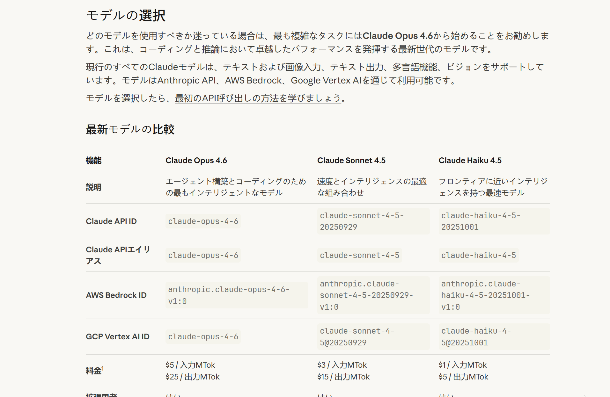

# Select AI - AI划词解释🎯

<div align="center">

**AI-powered 划词搜索工具 | 选中即解释 | 上下文感知**

[](LICENSE)
[]()

</div>
<div align="center">



</div>

## ✨ 核心功能

| 功能 | 描述 | 使用场景 |
|------|------|----------|
| 🎯 **智能划词** | 选中文字自动弹出悬浮按钮，点击即可查询 | 随时随地获取解释 |
| 🧠 **上下文感知** | 自动提取周围 500-3000 字符上下文，AI 理解更准确 | 专业术语、复杂句子 |
| 🚀 **流式输出** | 实时流式返回结果，边生成边展示 | 更快获得答案 |
| 🌐 **多语言支持** | 支持中文、英语、日语、韩语输出 | 外文阅读、学习 |
| 🔌 **多 API 支持** | MiniMax / OpenAI / Anthropic / DeepSeek / Zhipu AI / 自定义 API | 灵活部署、自建服务 |
| 💬 **Markdown 渲染** | AI 返回内容以优雅的 Markdown 格式展示 | 清晰的阅读体验 |
| 🔒 **隐私优先** | API Key 本地存储，不收集用户数据 | 安全使用 |
| 📄 **整页翻译** | 自动识别正文，批量翻译整个页面 | 外文网站阅读 |
| ✂️ **选中翻译** | 仅翻译选中的文本或段落 | 精准翻译需求 |
| 🔄 **智能缓存** | 切换显示无需重新请求，提升体验 | 重复查看场景 |
| ⚡ **并发翻译** | 支持多段落并发翻译，速度更快 | 批量翻译场景 |

## 📖 为什么选择 Select AI？

| 传统词典 | Select AI |
|----------|-----------|
| 只能查单词/短语 | 整段翻译解释，理解更全面 |
| 词库有限，更新滞后 | AI 实时理解，覆盖面更广 |
| 无上下文支持 | 自动获取上下文，专业术语也能懂 |
| 功能单一 | 支持多语言、多模型、个性化配置 |
| 付费订阅制 | 完全免费，无隐藏费用 |
| 数据上传云端 | 本地处理，安全无忧 |

## 🚀 快速开始

### 方式一：直接安装（推荐）

1. 下载 [chrome_extension.zip](chrome_extension.zip)
2. 解压到任意目录
3. 打开 Chrome，访问 `chrome://extensions/`
4. 开启右上角的 **"开发者模式"**
5. 点击 **"加载已解压的扩展程序"**
6. 选择解压后的文件夹

### 方式二：源码构建

```bash
cd select-ai
pnpm install
pnpm build
```

然后在 Chrome 中加载 `select-ai/dist` 目录

### 3. 配置 API

1. 点击扩展图标
2. 进入 **"设置"** 配置你的 API Key
3. 可自定义 API 端点和模型

## 🔧 开发

```bash
# 开发模式（热更新）
pnpm dev

# 构建生产版本
pnpm build

# 类型检查
pnpm type-check

# 代码检查
pnpm lint
```

## 💻 使用方法

1. 在任意网页中选中一段文字
2. 点击出现的粉紫色悬浮按钮
3. 等待 AI 分析并查看解释结果

## 🔌 支持的 API

该扩展兼容任意 Anthropic 格式的 API：

| Provider | 默认模型 | 说明 |
|----------|----------|------|
| **MiniMax** | MiniMax-M2.1 | 默认配置，开箱即用 |
| **OpenAI** | GPT-4o | 兼容 GPT 系列模型 |
| **Anthropic** | Claude 3.5 | 兼容 Claude 系列模型 |
| **DeepSeek** | DeepSeek Chat | 兼容 DeepSeek 系列模型 |
| **Zhipu AI** | GLM-4.7 | 智谱 AI 系列模型 |
| **自定义** | - | 任何兼容 Anthropic 格式的 API |

## 🛠️ 技术栈

<div align="center">

✨ **React 19** + TypeScript
⚡ **Vite 7** + HMR
🔒 **Manifest V3**
📦 **@crxjs/vite-plugin**
🎨 **Tailwind CSS 4**
📱 **Chrome Extension**

</div>

## 📁 项目结构

```
select-ai/
├── src/
│   ├── main.tsx                    # Popup 入口
│   ├── App.tsx                     # Popup UI
│   ├── background/
│   │   └── index.ts                # Service Worker（API 请求、流式处理）
│   ├── content/
│   │   ├── index.tsx               # Content Script 入口
│   │   ├── ContentApp.tsx          # 主控制器（划词检测 + 翻译协调）
│   │   ├── content.css             # 内容脚本样式
│   │   ├── InlineTranslator.tsx    # 整页/划词翻译器
│   │   ├── context/
│   │   │   └── TranslationContext.tsx  # 翻译状态管理
│   │   ├── components/
│   │   │   ├── FloatingButton/     # 悬浮按钮（拖拽、点击）
│   │   │   │   ├── index.ts
│   │   │   │   ├── FloatingButton.tsx
│   │   │   │   ├── useDraggable.ts
│   │   │   │   └── types.ts
│   │   │   ├── TranslationPanel/   # 翻译结果面板
│   │   │   │   ├── index.ts
│   │   │   │   ├── TranslationPanel.tsx
│   │   │   │   ├── BlockPanel.tsx
│   │   │   │   └── InlinePanel.tsx
│   │   │   └── TranslationContent/ # 翻译内容渲染
│   │   │       ├── index.ts
│   │   │       └── TranslationContent.tsx
│   │   ├── hooks/
│   │   │   ├── useTranslationStream.ts  # 流式翻译 Hook
│   │   │   └── useAbortController.ts    # 请求中断控制
│   │   └── utils/
│   │       ├── elementDetection.ts  # 正文元素识别
│   │       ├── markdown.ts          # Markdown 渲染
│   │       └── placeholder.ts       # 占位符管理
│   ├── options/
│   │   ├── index.tsx               # Options 入口
│   │   └── OptionsApp.tsx          # 设置页面 UI
│   ├── utils/
│   │   ├── ContextExtractor.ts     # 上下文提取（500-3000字符）
│   │   ├── language.ts             # 语言检测
│   │   ├── i18n.ts                 # 多语言文案
│   │   ├── SiteBlacklist.ts        # 网站黑名单
│   │   └── ContentPriority.ts      # 内容优先级算法
│   ├── assets/
│   │   └── react.svg
│   ├── App.css
│   └── index.css
├── public/
│   ├── icon.svg
│   ├── icon-16.png
│   ├── icon-48.png
│   ├── icon-128.png
│   └── icon.png
├── scripts/
│   └── convert-icon.cjs            # 图标转换脚本
├── index.html                       # Popup HTML
├── options.html                     # Options HTML
├── manifest.json                    # 扩展配置
├── vite.config.ts                   # Vite 构建配置
├── postcss.config.js                # PostCSS 配置
├── eslint.config.js                 # ESLint 配置
├── tsconfig.json                    # TypeScript 配置
├── package.json                     # 依赖配置
└── README.md                        # 本文档
```

## 🤝 贡献

欢迎贡献代码、提交 Issue 或提出建议！

- 🐛 发现 Bug？请 [提交 Issue](https://github.com/yourusername/select-ai/issues)
- 💡 有新想法？请 [提交 Feature Request](https://github.com/yourusername/select-ai/issues)
- 🔧 想贡献代码？请 Fork 后提交 PR

## 📝 常见问题

**Q: 为什么扩展没有响应？**
A: 请确保已在设置中配置了有效的 API Key。

**Q: 为什么没有出现悬浮按钮？**
A: 检查页面是否有内容脚本限制。部分网站（如 `chrome://` 页面）无法注入内容脚本。

**Q: 支持哪些 API？**
A: 支持 MiniMax、OpenAI、Anthropic、DeepSeek、Zhipu AI，以及任何兼容 Anthropic 格式的自定义 API。

## 📄 许可证

MIT License - 详见 [LICENSE](LICENSE)

---

<div align="center">

**如果这个项目对你有帮助，欢迎点亮 Star ⭐**

</div>
